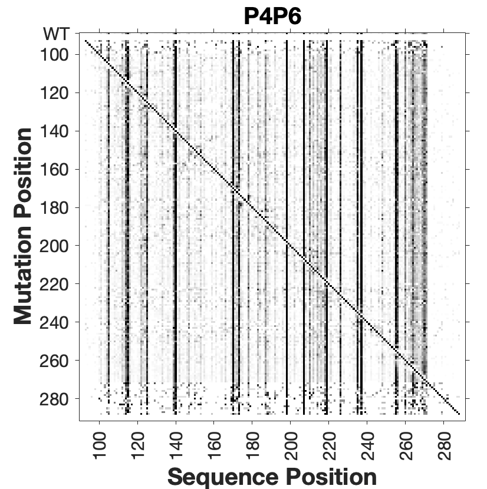
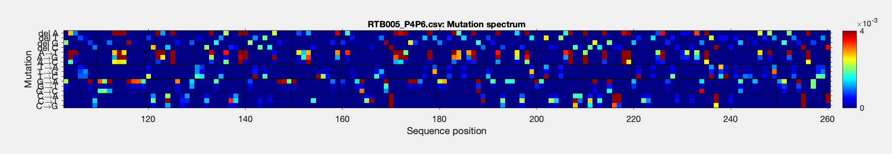

# M2seq
## Analysis of 2D mutate-and-map signal in next-generation-sequencing data


### Installation
Ensure that you have the following installed:

* Novobarcode, part of the Novoalign software package, which up until version 3, has been freely available for educational and not-for-profit use. Download version 3 of Novoalign at http://www.novocraft.com/support/download/
* ShapeMapper 1.2, software developed by the Weeks lab at UNC Chapel Hill for 1D analysis of mutational profiling data. Available at https://github.com/Weeks-UNC/ShapeMapper_v1.2  (Make sure you go into that directory and run `make` and `chmod +x ShapeMapper.py`)
* BowTie2 is needed for ShapeMapper. Available here: https://sourceforge.net/projects/bowtie-bio/files/bowtie2/2.2.9/. Version 2.2.9 works.
* `python2.7`. Most modern environments have moved on to `python3.x`, so this requires reinstating python2.7:
	* Clusters may have `python2.7` available through a module, accessed through `module load python/2.7`. 
	* If that doesn't work, you may need to install `python2.7` to run in a virtual environment through `virtualenv`. 
	* Make sure that if you type `python`, you see version `Python 2.7.x` displayed at the interactive prompt. 
* the `nwalign`, `numpy`, `scipy`, and `matplotlib` python packages, which you can install via `sudo pip install nwalign`. 
	* Note: If `pip` does not work in `python2.7`, you can get it through `curl 'https://raw.githubusercontent.com/pypa/get-pip/20.3.4/get-pip.py' -o get-pip.py` and then `python2 get-pip.py`.
	* You can test correct installation, by typing `python`, and check that  `import nwalign`, etc. all work without errors.
* You may also need `libpng v1.2`, available through `module load libpng/1.2` on clusters -- you'll need to install it otherwise. Check in `python` if you can `import matlab._png` without errors.
* The RDATkit for handling RDAT data files. Note while there is a pip installable version of this package, it may not install correctly. Instead, grab [Version 1.6](https://github.com/ribokit/RDATKit/releases/tag/v1.6). Make sure to setup `path.py` in `rdatkit` and also add to your Python path with a command like: `export PYTHONPATH=$PYTHONPATH:/PATH/TO/RDATKit-1.6/`.

Add the M2seq, novobarcode, etc. folders to your PATH. For example in your `.bashrc` add lines like `PATH=$PATH:$HOME/src/M2seq`.

### Running the code
To test on example sequencing data, download the two example FASTQs from [this link](https://www.dropbox.com/sh/0xrs2aypzzlims9/AACFa_pbuZ8QYB1O2rE-1fN-a?dl=0) and move them to the Tutorial folder. Then, run:

    m2seq.py P4P6.fa RTBbarcodes.fa Sample1_S1_L001_R1_001.fastq Sample1_S1_L001_R2_001.fastq --config example.cfg --offset 89
* `P4P6.fa` [required] is a fasta-formatted file with the name and sequence of the RNA. Note that the name of the fasta file and the sequence in the fasta file must match the name of the reference sequence given in the config file.
* `RTBbarcodes.fa` [required] is a Novobarcode-formatted file with the names and sequences of the barcodes in the RTB primers.
* The read 1 and read 2 `FASTQ`s are required inputs.
* `example.cfg` [optional] is a config file in the format required by ShapeMapper. If a config file is provided, the 2D dataset will be generated by ShapeMapper analysis followed by conversion of binary mutation-counted files to 2D data that are output as RDAT files. The correct names of the conditions in the pilot experiment used for this tutorial are already input in the [alignments] and [profiles] sections of the config file. These sections must be edited for different experiments.
* Make sure no spaces are in any of the folder names parent to this directory -- you may see fails of bowtie2 otherwise.
* *Useful tip*: Especially if this is your first run, tou may want to do a 'pilot run' with test fastq files that hold just a few test lines from your full `FASTQ` files. Prepare these as `head -n 10000  Sample1_S1_L001_R1_001.fastq  > test/Sample1_S1_L001_R1_001.fastq` and
`head -n 10000  Sample1_S1_L001_R2_001.fastq  > test/Sample1_S1_L001_R2_001.fastq` and supply `test/RTBbarcodes.fa Sample1_S1_L001_R1_001.fastq test/Sample1_S1_L001_R2_001.fastq` in the `m2seq.py` command line.
* If you need to rerun, you'll need to cleanly remove the previous output directories: `rm -rf 1_Demultiplex/ 2_ShapeMapper/ 3_M2seq/`.

The `m2seq.py` command performs the following:
* First, it uses Novobarcode to demultiplex the pairs of sequencing reads using the barcodes provided in RTBbarcodes.fa
* Then, it performs ShapeMapper analysis with the settings in the config file to compare the reference sequence to the paired sequencing reads for each barcode
* ShapeMapper outputs a mutation strings text file for each barcode recording the mutations per read compared to the reference sequence, which is then converted to binary format
* The binary-formatted mutation strings are analyzed with simple_to_rdat.py to generate 2D datasets

The output of the pipeline includes, for each barcode:
* 2D reactivity RDAT
* 2D raw counts RDAT
* counted mutations over all sequencing reads
* log files
The ExampleResults archive contains these expected outputs from running the analysis on the example sequencing data at the link above.

### Visualizing the mutate-and-map output
The key modes of visualizing the M2seq data are as a 2D plot (mutate-and-map style) and as mutation spectra (rates of mutation/deletion both across the sequence and on average).

To view the 2D plot, open MATLAB, make sure the `matlab` folder and subfolders are in your MATLAB path (check with `Set Path/Add to Subfolders...`), and run:

    m2seqplot('3_M2seq/simple_files/RTB005_P4P6.reactivity.rdat');

Compare the resulting plot to the 2D plot in the `ExampleResults` folder: `Example2D.eps`

It should look something like this:



To view the mutation spectra, open MATLAB and run:

    mut_heatmap('2_ShapeMapper/output/counted_mutations/RTB005_P4P6.csv',103:260,'',13);

One of the figures should look like this:



Compare the resulting plot to the mutation spectra in the Figures folder: `ExampleSpectra.eps`, `ExampleSpectra_mut_avg.eps`, `ExampleSpectra_mut_max.eps`

### Structural analysis
Two modes of structural analysis are available:

* `M2-net` is a neural-net-inspired analysis that detects helix signatures in the mutate-and-map data without making assumptions about RNA folding energy models. It largely reproduces visual analysis.

* The `RNAstructure` secondary structure modeling package (version 6.0, expected to be released in mid-2017) can take in M2seq data to guide modeling of all the helices in a model and estimate confidence in the structures.

Both styles of analysis can be run through `MATLAB` scripts available in the **Biers** repository – check out [installation instructions](https://ribokit.github.io/Biers/install/) and some [examples on the P4-P6 and GIR1 RNAs](https://ribokit.github.io/Biers/rnastructure/#rnastructure-M2seq) on RiboKit.

A standardized workflow that runs each of the above steps is available through the command:

```
run_m2seq_plots('3_MaP2D/simple_files/RTB000_P4P6_P4P6noHP.reactivity.rdat','3_MaP2D/simple_files/RTB005_P4P6_P4P6noHP.reactivity.rdat');
```

with example output in `ExampleResults/m2seq_plots/`.

### Citation
If you use this software, please cite:
	
Cheng, C. Kladwang, W. Yesselman, J. Das, R. (2017) "RNA structure inference through chemical mapping after accidental or intentional mutations" Proc Natl Acad Sci U S A. 2017 Sep 12;114(37):9876-9881. [doi: 10.1073/pnas.1619897114](https://doi.org/10.1073/pnas.1619897114)
